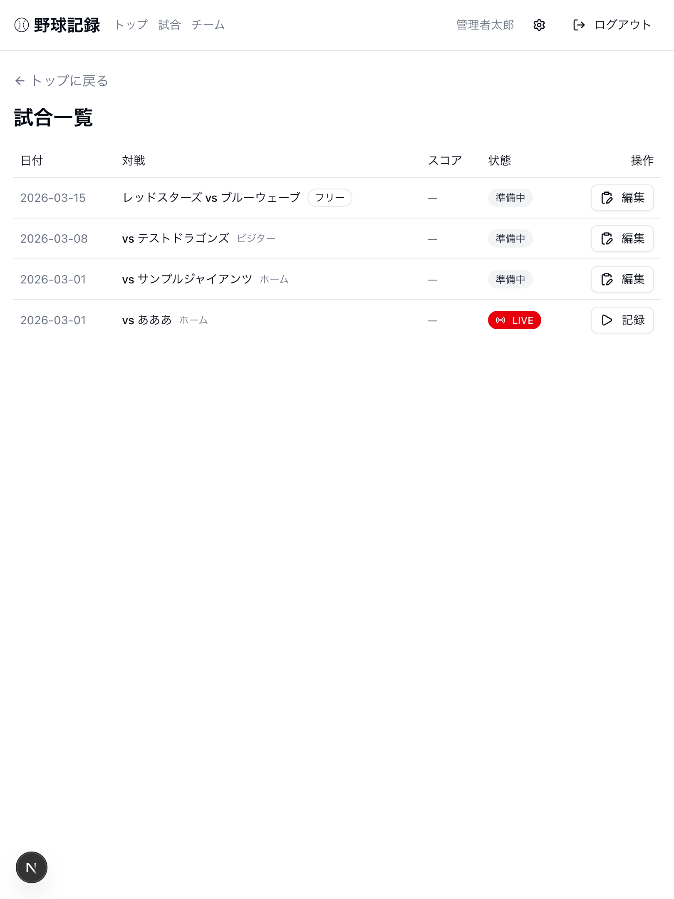
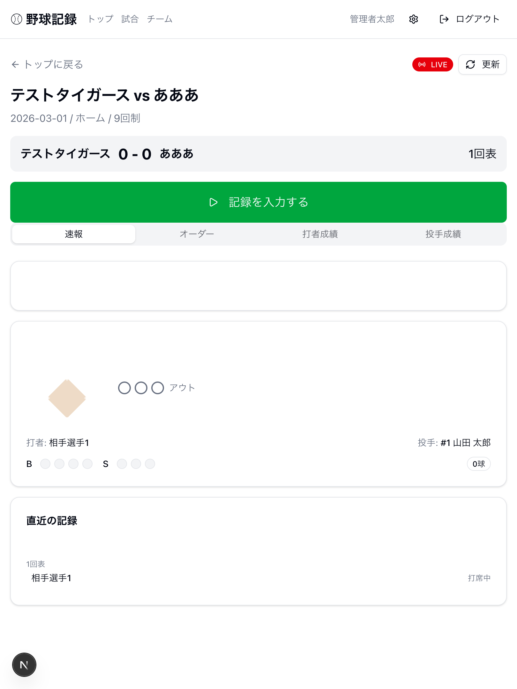
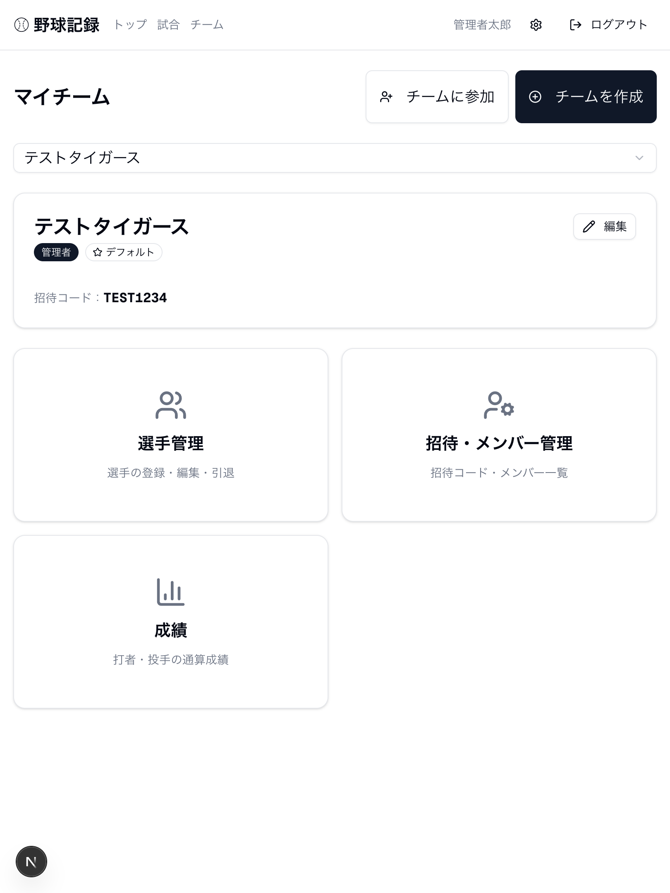

# ⚾ 草野球スコアブック

草野球の試合をかんたんに記録・管理できる Web アプリです。iPad（タブレット縦持ち）での操作に最適化されています。


## 主な機能

- **試合記録** — 打席結果・投球をリアルタイムに記録
- **スコアボード** — イニングごとのスコアをライブ表示
- **成績管理** — 打率・防御率などを自動集計（試合別・通算）
- **チーム管理** — 選手登録・オーダー編成・招待コードでメンバー追加
- **ライブ共有** — Supabase Realtime でスコアをリアルタイム共有

## スクリーンショット

| 試合一覧 | 試合詳細（速報） | チーム管理 |
|:---:|:---:|:---:|
|  |  |  |

## 技術スタック

| カテゴリ | 技術 |
|---|---|
| フレームワーク | Next.js 16 (App Router) |
| 言語 | TypeScript |
| UI | shadcn/ui, Tailwind CSS v4 |
| 認証・DB | Supabase (Auth, PostgreSQL, Realtime) |
| テスト | Vitest, React Testing Library |
| パッケージ管理 | pnpm |

## セットアップ

### 前提条件

- Node.js 18+
- pnpm
- Docker Desktop（ローカル Supabase 用）

### インストール

```bash
pnpm install
```

### ローカル Supabase の起動

```bash
cp .env.local.example .env.local
pnpm supabase:start
pnpm supabase:reset   # マイグレーション適用 + テストデータ投入
```

### 開発サーバー

```bash
pnpm dev
```

http://localhost:3000/login を開き、テストアカウントでログインできます。

| ユーザー | メール | パスワード | 権限 |
|---|---|---|---|
| 管理者 | `admin@example.com` | `password123` | admin |
| メンバー | `member@example.com` | `password123` | member |

## コマンド一覧

```bash
pnpm dev              # 開発サーバー起動
pnpm build            # プロダクションビルド
pnpm lint             # ESLint
pnpm test             # テスト実行（一度）
pnpm test:watch       # テスト（ウォッチモード）
pnpm supabase:start   # ローカル Supabase 起動
pnpm supabase:stop    # ローカル Supabase 停止
pnpm supabase:reset   # DB リセット + seed 適用
pnpm supabase:status  # Supabase 稼働状況の表示
```

## ライセンス

Private
